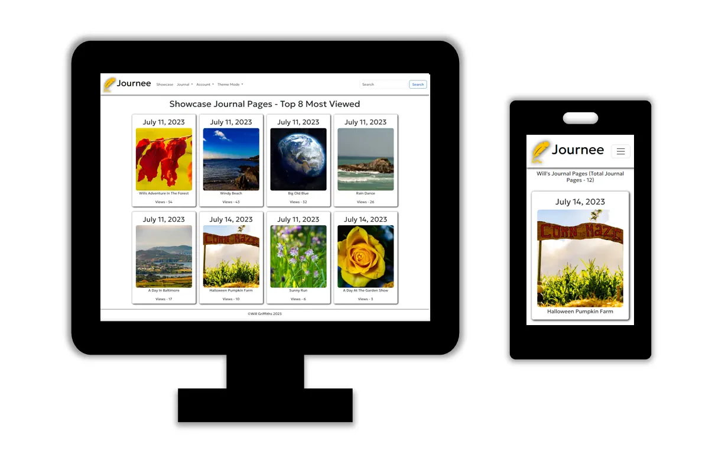
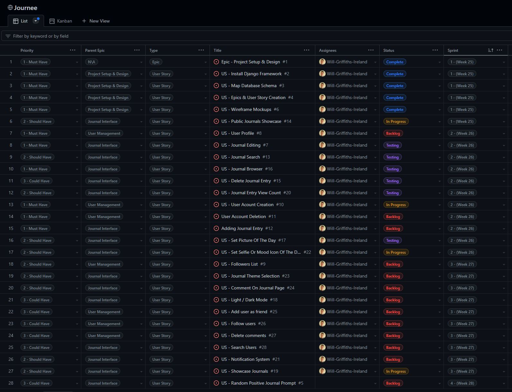
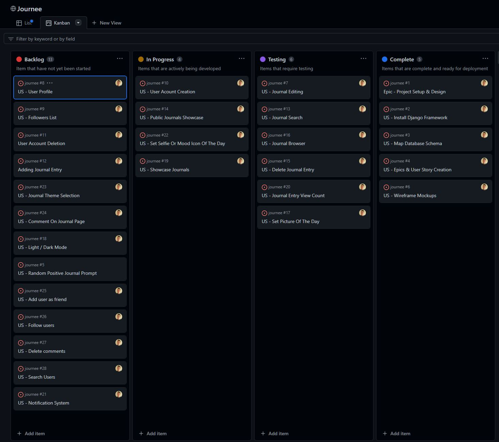
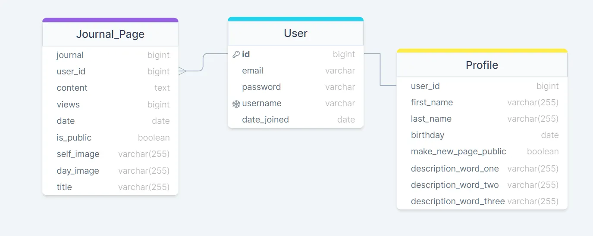

# __Journee__

Journee is a platform that gives you the freedom to journal the important parts of your life, either just for you or for others to share in. It’s a great way to capture a single page for that day along with a photo and selfie, if you wish. You then have a chronological history of all the things you want to look back on in years to come. It’s a great way to stay connected with your journey through life and share it with others!

## Planning

The initial plan for the site was to include more interaction features such as comments and reactions, along with notifications and approval mechanisms. After careful consideration I decided that these features would actually detract from the simplicity of the application, after seeing friends and family with various social media apps that bombarded them with notifications and reminders I decided this is not what I wanted.
A journal is really about you and documenting your story. I didn’t want it to become a race to build followers/friends or to tailor your content to please or attract others.
I did want to give users the ability to share their journal with others but not for this to be the default, when a user creates a new journal page it's private by default and they have to choose to publish it for others to see.

### Target Audience

* Anyone that wants to keep a journal of their life
* This site is aimed at all ages. This was a big driver in how focused the user interface is.

### Core Features

* Frictionless Sign Up & Sign In
* View/search public journals without an account (Entices Sign Up)
* Showcase journal entries on the landing page
* Abilty to switch site style (light/dark/customer colour modes)
* Add/edit/delete journal pages
* Limit of 1 page per day
* Limit of 1 photo and Selfie per day
* Default images for those that do not want to add photos
* Ability to make journals private/public

### User Interface

When I was working on the concept for Journee I wanted to present the user with an experience that was similar to a traditional diary. I wanted to keep the interface very clean and focused the users attention on the main content.
To that end, each page has a title, content, and an optional selfie/photo.

### Colour Theme

I played with multiple different colour ideas for the site and in version 1 of the site I have utilized a simple light and dark interface that embraces the standard bootstrap colour mode that is tried and tested. A future enhancement would be to create further customized colour modes and CSS that allow for theming of "Sci-fi" or "Retro" type looks.

### Agile Planning ###

I used the agile method to plan out Journee and you can review all my Epics and User Stories in the Project linked to this repo [__Here__](https://github.com/users/Will-Griffiths-Ireland/projects/2/views/2)

* I took the role > action > benefit approach to writing my user stories.
* I used a customized list view and Kanban for planning.
* 4 sprints of 1 week each were planned and assigned to each item 

I won't repeat all the details here as you can view the public project but here are a few screens of the project in flight.

## Database Design Schema

After descoping features that would have made the application more noisy to users I ended up with a a straighforward schema.
I have omitted the fields in the all-auth table that are unused.

## User interface Design

All my intial wireframe concepts can be found here in a PDF.

The basic layout of the site aims to be simple and intuitive for anyone to pickup and use within seconds

## Features

### User Account Creation

### View Count

* Each journal entry has functionality to track how many views it has had.
* This allows a user to know how many others viewed their public journal page.
* The count is also used in picking content for the showcase page.
* The logic delibrately counts every single view to allow for a simulated production expereince during testing and review.
* With a launched site this functionality would be modified to use something like Django-Hitcount so that only unique views per IP would be counted

### Customer Error Messages

## Testing

All details on testing can be found here

## Technoligies & Tools

* Bootstrap 5.3
* Jquery 3.7.0
* Django

## Deployment

* clone repo
setup db
setup cloud storage
deploy to Heroku

## Future Enhancements

* Full encrption of all user journal and profile information
* Ability to search users based on their description words
* Ability to follow other users and have a dedicated page view of their pages

## Credits & Acknowlegements

* Boot strap docs
* Django docs