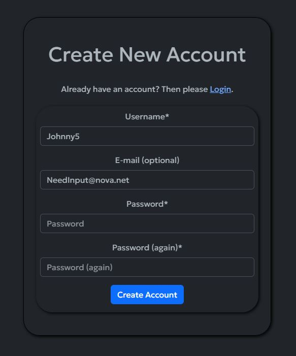

# __Journee__

Journee is a platform that gives you the freedom to journal the important parts of your life, either just for you or for others to share in. It’s a great way to capture a single page for that day along with a photo and selfie, if you wish. You then have a chronological history of all the things you want to look back on in years to come. It’s a great way to stay connected with your journey through life and share it with others!

## Planning

I thought a lot about how I could bring to life my idea of an online journal where users could document their journey through life. It came from reading old diaries my father kept, they were a portal into the past, with a simplistic charm. I wanted to create something modern but connected to the spirit of the past where you had one day of condensed notes.
The name comes from a combination of...

* Journal
* Journey
* Journée (French for day)

The initial plan for the site was to include more interaction features such as comments and reactions, along with notifications and approval mechanisms. After careful consideration I decided that these features would actually detract from the simplicity of the application, after seeing friends and family with various social media apps that bombarded them with notifications and reminders I decided this is not what I wanted.
A journal is really about you and documenting your story. I didn’t want it to become a race to build followers/friends or to tailor your content to please or attract others.
I did want to give users the ability to share their journal with others but not for this to be the default, when a user creates a new journal page it's private by default and they have to choose to publish it for others to see.

I also wanted to give user the choice of including media but didn’t want it to become of massive collection. Like the journal entry I have limited it to one per day so the users will think carefully about what they upload

### Target Audience

* Anyone that wants to keep a journal of their life
* This site is aimed at all ages. This was a big driver in how focused the user interface is.

### Core Features

* Frictionless Sign Up & Sign In
* View/search public journals without an account (Entices Sign Up)
* Showcase journal entries on the landing page
* Abilty to switch site style (light/dark/custom colour modes)
* Add/edit/delete journal pages
* Limit of 1 page per day
* Limit of 1 photo and selfie per day
* Default images for those that do not want to add photos
* Ability to make journals private/public
* Extended profile that alows a users private/public publishing preference to be stored 

### User Interface

When I was working on the concept for Journee I wanted to present the user with an experience that was similar to a traditional diary. I wanted to keep the interface very clean and focus the users attention on the main content of the journal entry.
To that end, each page has a title, content, and an optional selfie/photo.

### Animations

I do use some animations across the site to make it a little more engaging for users.

* Desktop hover animations on cards provide a scale animation. This is turned off for mobile.
* Across desktop and mobile I use a quick fade on elements as they are presented to the user

### Colour Theme

I played with multiple different colour ideas for the site and in version 1 of the site I have utilized a simple light and dark interface that embraces the standard bootstrap colour mode that is tried and tested. A future enhancement would be to create further customized colour modes and CSS that allow for theming of "Sci-fi" or "Retro" type looks.

The primary acent colour I used for the logo/favicon is an amber orange yellow #FFC000. This is a nod to yellow writing paper and old books.

### Fonts

The application is using the google font 'Geologica' with a fallback to sans-serif

### Agile Planning ###

I used the agile method to plan out Journee and you can review all my Epics and User Stories in the Project linked to this repo [__Here__](https://github.com/users/Will-Griffiths-Ireland/projects/2/views/2)

* I took the role > action > benefit approach to writing my user stories.
* I used a customized list view and Kanban for planning.
* 4 sprints of 1 week each were planned and assigned to each item 

I won't repeat all the details here as you can view the public project but here are a few screens of the project in flight.

## Database Design Schema

After descoping features that would have made the application more noisy to users I ended up with a a straighforward schema.
I have omitted the fields in the all-auth table that are unused.

## User interface Design

All my intial wireframe concepts can be found here in a [PDF](docs/Journee_wireframes.pdf).

The basic layout of the site aims to be simple and intuitive for anyone to pickup and use within seconds.

## Features

### Showcase Page

The showcase page is designed as the landing spot for all users. It helps make the site come to life and encourages people to take a look at others’ journals, then hopefully sign up and start their own.

* Top 8 most viewed public journal pages
* Displayed to both unauthenticated and authenticated users
* Future enhancements would include an element of user customisation such as selecting what type of content to show

### Theme Mode

I utilised bootstraps new colour mode to include both a light and dark mode.
The screenshots througout the readme have a mix of the modes

* All user can chose their preference and it is stored/retrieved in local storage
* Auto will detect the users current system preference

### User Account Creation

The user account creation utlizes django-allauth

* The username must be unique to this system and the user will get a warning if its in use.
* Email is an optional field but please note this is only for testing and review. For the production website I would enable email verification to avoid account spamming and enable password resets via email
* The password field applies the standard security hardening for length and complexity.

### Message Notifications

All user interactions with the database will result in an onscreen message that is displayed in the top center of the screen for 3 seconds before it fades away.

* Sign in / out
* Adds
* Edits
* Deletes

### User Login

* The user login screen asks for the username and password
* A message is shown to the user if their credentials do not match any stored records

### Adding A Journal Page

Once a user has an account and is signed in they can create a journal entry.

* The title and journal entry are mandatory fields
* The title is limited 30 characters and the journal entry is 15000
* I used the django richtextfield widget for the journal entry to allow for a little formatting
* The user has the option to make the entry public, without any extended profile preference the default is private. I did this on a per page level to give the user full control of what they want to make public or not
* The self image is optional and will be replaced by the Journee logo if the user does not upload one. I have this for users that want to track their how they look/age
* The day image is basically for the photo the user thinks will sum up their day. Again if they choose not to then the logo is used.
* Users are blocked from uploading files other than image files
* Images are resized to 200px for self images and 800px width for day images and encoded as webp for optimum file sizes
* The user is limited to a single journal page per day and will get a warning if they already have one which has a link to it. Please note that while I was testing and creating content to fill the site I disabled the date check so thats why you will see multiple pages for the same day.

### User Journal View

The Journal view is the users collection of journal pages

* They are brought to this view when they submit a new journal page
* The journal view is paginated to 4 preview cards per page
* The total number of pages is displayed in the heading
* Previous and next buttons allow the user to flick through their journal
* This page is private to the user so they will be able to see all of their pages irrespective of if they are set public or private

## Journal Page View

The journal page view is where the user views and reads that page

* The self image is displayed at the top
* The title, public/private status and view count are alongside
* The day photo is next with the journal entry below it.
* If the user is the creator of the page then they will have edit/delete buttons at the bottom of the page

Below are Desktop and Mobile Screenshots

Example of page with no images upload that is automatically using the placeholder logo images

### Editing A journal Page

* If a user is the creator of a journal page then they will see a button to edit it
* Editing the page is similar to the create view but any existing information is pre populated
* All the same validation rules apply for editing

### Deleting A Journal Page

* If a user is the creator of a journal page then they will see a button to delete it
* Before the record is deleted the user gets a warning about removing the page
* The warning contains both the date and title of the page for user verification
* Clicking confirm removes the record and takes them back to the journal view
* Clicking cancel will take them back to the journal page they were viewing

### Journal Search

Users have a search box in the top left of the navbar so they can search for others users journals with content that relates to them

* All public journals with a journal entry containing the searched string will be returned
* Results are paginated
* An empty search will return all public journals

### View Count

* Each journal entry has functionality to track how many views it has had.
* This allows a user to know how many others viewed their public journal page.
* The count is also used in picking content for the showcase page.
* The logic deliberately counts every single view to allow for a simulated production experience during testing and review.
* With a launched site this functionality would be modified to use something like Django-Hitcount so that only unique views per IP would be counted

### Custom Error Messages

Standed errors such as 500, 404 and 403 have custom templates that are displayed to the user

### Profile Page

The extended profile is optional. The site is fully functional without adding this. The purpose of the profile is to capture users preferences and customise their experience further.

* Once a user has added a profile they can edit it in the future
* None of the fields are mandatory
* The primary functional field for version 1 is the option to choose if new pages are set to be made public. If the user enables this, then any new journal pages they create will have the checkbox to make them public checked.
* Name fields are for future fucntionality where a user can choose how their name is displayed.
* The description words are for a future enhancement where users can search for other users with a similar set of words.

## Testing

All details on testing can be found [here](TESTING.MD)

## Technologies & Tools

* Github & Codespaces (Ubuntu 22.04.2 LTS)
* Python 3.8.12
* Bootstrap 5.3
* Jquery 3.7.0
* Django 3.2.19
* HMTL 5
* CSS 3
* Javascript
* DrawSQL
* Paint.net
* MS Powerpoint
* Heroku
* cloudinary.com
* elephantsql.com

## Packages

You can check all the packages/libs and their versions in the [requirements.txt](requirements.txt)

## Deployment

Below is a general guide for deploying this application yourself.

There are many options for PaaS, database hosting services, and file hosting services. If you use different providers to me then you will need to configure [journee/settings.py](journee/settings.py) further to what I mention below and need to refer to the relevant [Django documentation](https://docs.djangoproject.com/en/3.2/) for the correct settings.

Ideally connect your forked repo with a cloud based IDE like Codespaces/Gitpod/Codeanywhere and use a linux based container/workspace.
This repo is built on template the code institue developed (.devcontainer) that works well with Codeanywhere and triggers a build of the base enviroment (Ubuntu 22.04.2 + python 3.8)

* Fork the github repo (recommended) or clone the repo locally
* Setup your cloud enviroment 
* Install all the required packages ( just run the command __pip install -r requirements.txt__ )
* Setup an account and a new database on https://www.elephantsql.com/
* Update the DATABASE dictionary in settings.py to point to your HOST/NAME/USER
* Setup an account on http://www.Cloudinary.com
* Create an env.py in your projects root and add it the .gitignore file,then add the below code with these settings
* Update the secret key with a random string of your choosing, and update the elephantsql DB_PASSWORD with your own, finally put your own cloudinary connection url in
>import os
>os.environ['SECRET_KEY'] = '--UNIQUE SECRET KEY--'  
>os.environ['DEV'] = 'True'  
>os.environ['CLOUDINARY_URL'] = '--URL TO ACCESS CLOUDINARY--'  
>os.environ['DB_PASSWORD'] = '--PASSWORD FOR DB CONNECTION--'

* Run a django migration (python manage.py migrate) to create the tables on your database
* Create an account on Heroku and create a new app
* Update the apps settings with config vars that match those in the env file SECRET_KEY, CLOUDINARY_URL, DB_PASSWORD
* Deploy App 

## Future Enhancements

* Full encrption of all user journal and profile information
* Ability to search users based on their description words
* Ability to follow other users and have a dedicated page view of their pages, while keeping the experince passive and unintrusive
* Profile can set preference for color and font

## Media

* A few headshots were used from www.pexels.com during testing
* All others photos are my own work
* Johnny 5 rights are with Spyglass Media Group (just a bit of fun for testing)
* The Quill logo was created from a free icon in MS Powerpoint

## Credits & Acknowlegements

* Code Institues Learning Material
* [Daisy McGirr's](https://www.youtube.com/@IonaFrisbee) really relaxed and informative tutorials
* [Tech With Tim's](https://www.youtube.com/@TechWithTim) huge catalog of really easy to digest tutorials
* Bootstraps documentation and examples (JS was used per bootstrap instructions)