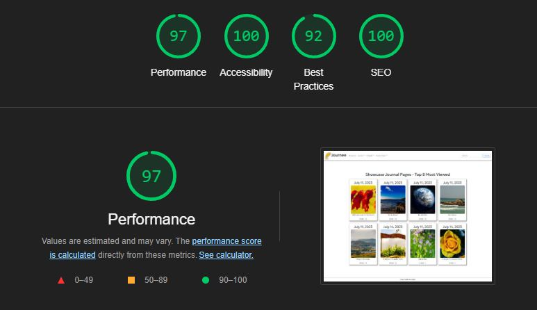
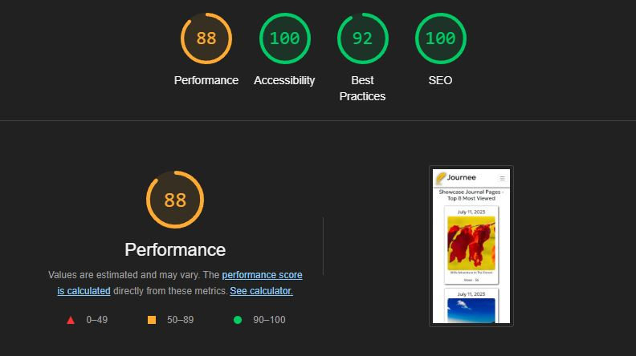

## Overview

* For this project I decided to focus on a full suite of manual tests based around the core user experience.
* I based the tests around the end to end user journey

### Validators

* All rendered html was validated with ...
* CSS was validated with ...
* All __custom__ Python code was linted along the way and validated in the CI tool

### Lighthouse Scores

The sites lighthouse results were good. The callout on mobile tests were due to image sizes but I already had them in a sweet spot to work for both desktop and mobile, lighthouse has some agressive ideas about mobile sizes that are a bit outdated in todays world of high res screen phones we have close to our faces :)

### Manual Tests

|Test| Result | Note
|--|--|--|
| Does the main page display correctly? | Pass | N\A |
| Is the page responsive to different devices? | Pass | N\A |
| Does the navbar only show links available to anon users? | Pass | N\A |
| Does the showcase page display just the 8 top-viewed pages? | Pass | N\A |
| Are the showcase cards displayed in order of most views? | Pass | N\A |
| Does clicking a showcase card take you to that page? | Pass | N\A |
| Does clicking Account > Create Account, open create account page? | Pass | N\A |
| Does the create account page validate that the username field is not blank? | Pass | N\A |
| Does the create account page validate that the username entered is not in use? | Pass | N\A |
| Does the password validator ensure strong password? | Pass | N\A |
| Does the account get created when the user clicks create account | Pass | N\A |
| Does the user get automatically signed in? | Pass | N\A |
| Does the user get a message at the top of the screen to confirm sign in? | Pass | N\A |
| Does the navbar show extra options for authenticated user | Pass | N\A |
| Does the Theme Mode switch between Light/Dark mode? | Pass | N\A |
| Does the Theme Mode >> Auto detect users system preference? | Pass | N\A |
| Does clicking the Account > Logout (USER) link show the confirmation? | Pass | N\A |
| Does confirming logout then logout the user and take them to the showcase page?| Pass | N\A |
| Does the user get a message at the top of the screen to confirm they signed out? | Pass | N\A |
| Does clicking Journal > Add Page open the journal add page?  | Pass | N\A |
| Do all fields validate input? | Pass | N\A |
| Do required fields provide feedback if empty? | Pass | N\A |
| Does trying to upload an non image file get blocked| Pass | N\A |
| Does the user get a message at the top of the screen to confirm they created a journal page?  | Pass | N\A |
|  Does the user get taken to their Journal View page once they create a page? | Pass | N\A |
| Does the Journal View page display the total number of pages the user has in their Journal? | Pass | N\A |
| Does the Journal View page paginate results to 4 journal pages per page? | Pass | N\A |
| Do the previous/next buttons transition to the correct page of results? | Pass | N\A |
| Do the previous/next buttons enable/disable when at the beginning/end of the results | Pass | N\A |
| Does the journal page view open correctly when clicked? | Pass | N\A |
| Does the total view count display and update on page views? | Pass | N\A |
| Do the images display correctly? | Pass | N\A |
| Do all fields correctly render with formatting? | Pass | N\A |
| Do edit/delete buttons display if user created page? | Pass | N\A |
| If the user doesn't upload images do placeholders get displayed?| Pass | N\A |
